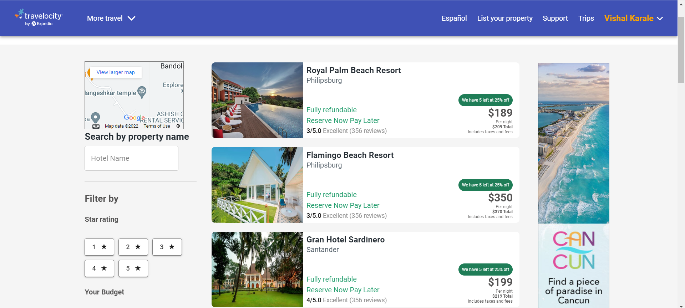

# Travelocity Clone

**This is the clone of the Travelocity website. Travelocity.com is a leading online travel Web site where travelers can make airline, hotel, and car rental reservations, book cruises and vacation packages, find information about destinations, and access a range of other travel-related services.**

**To see the live site click the below link.**

""

**To see the Demo Video of Website click the below link.** - •[Travelocity](https://travelcity-clone.netlify.app/)

## deployed link here

## Team Members

> ## Github :- •[Akram Ali](https://github.com/akram3598786)
>
> ## Github :-•[Vishal Karale](https://github.com/vishalvsk)
>
> ## Github :- •[Mohit Sharma](https://github.com/mohitsharma9001)
>
> ## Github :-•[Chandan Giri](https://github.com/chandan0c)

## Built with

<ul>
  <li>React js</li>
  <li>Redux</li>
  <li>HTML</li>
  <li>CSS</li>
  <li>JavaScript</li>
  <li>Github</li>
</ul>

## Used libraries

<ul>
  <li>node modules</li>
  <li>Styled-Components</li>
  <li>Redux</li>
  <li>React Js</li>
  <li>Redux</li>
  <li>React-router-dom</li>
  <li>Material-UI</li>
  <li>Material-Icons</li>
  <li>React Icons</li>
</ul>

## Features

<ul>
  <li>Signin/Signup</li>
  <li>Hotel search across world's cities</li>
  <li>Hotel Booking</li>
  <li>Individual Hotel Details Pages</li>
  <li>Filter hotels list by their ratings, hotel name and price etc.</li>
</ul>

## Some screenshots of the project :-

### Thanks for Reading.
